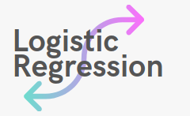
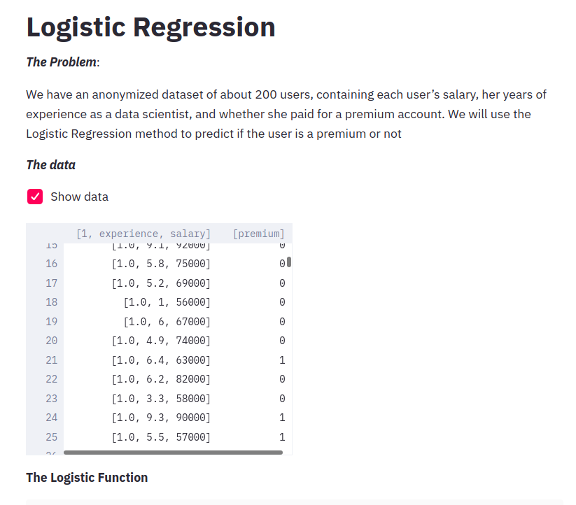
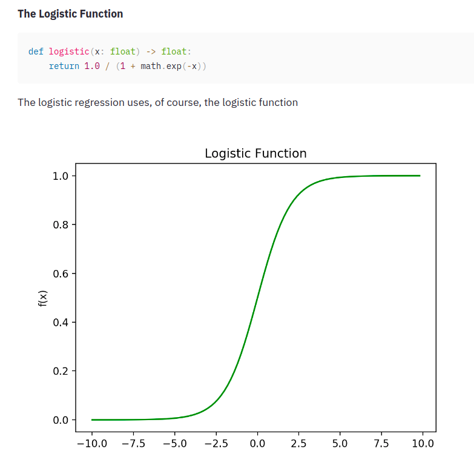
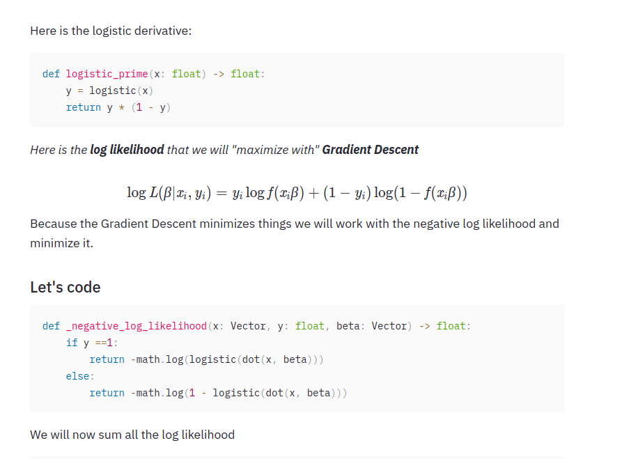
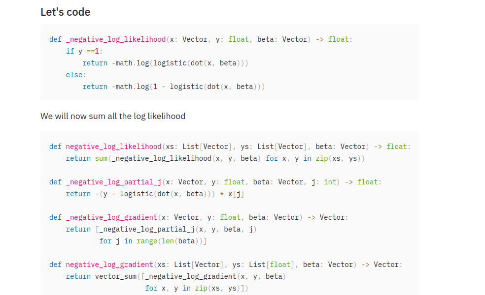

The purpose of this repository is my self practice of Logistic Regression. I am a student that is learning, let me know if you find any errors,the code is inspired from examples and exercises found in books and other sources (links below)

## Resources that I used to learn about this fun topic:
* Book: Data Science from Scratch, Joel Grus
* https://www.youtube.com/watch?v=JDU3AzH3WKg&t=807s
* https://ml-cheatsheet.readthedocs.io/en/latest/logistic_regression.html
* https://towardsdatascience.com/logistic-regression-detailed-overview-46c4da4303bc
