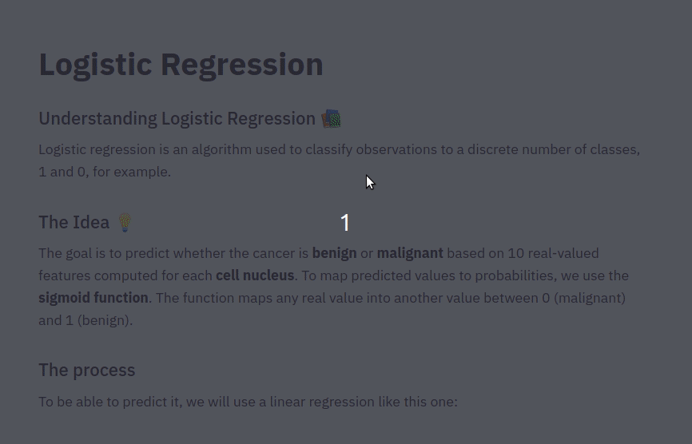

# Logistic Regression
## Working with the Sklearn Breast Cancer dataset

The purpose of this repository is myself practice of Logistic Regression. I am a student that is learning, let me know if you find any errors, **the original code is from examples and exercises found in books, tutorials and other sources all mentioned in this file.** I am just practicing what I have learned, the proper authors and creators of the algorithms/code are the ones mentioned in the file.

I will be using Streamlit to develop an App where I will be sharing what I've learned. To run the app install streamlit and run the following command:


```
pip install streamlit
streamlit run https://raw.githubusercontent.com/parismollo/LogisticRegression/master/logistic_regression.py
```



## Resources that I used to learn about this fun topic:
* Tutorial Python Engineer :https://www.youtube.com/watch?v=JDU3AzH3WKg
* Book: Data Science from Scratch, Joel Grus
* https://ml-cheatsheet.readthedocs.io/en/latest/forwardpropagation.html#  
* https://scikit-learn.org/stable/datasets/index.html#breast-cancer-dataset
* https://www.youtube.com/watch?v=JDU3AzH3WKg&t=807s
* https://ml-cheatsheet.readthedocs.io/en/latest/logistic_regression.html
* https://towardsdatascience.com/logistic-regression-detailed-overview-46c4da4303bc
* Maximum likelihood https://www.youtube.com/watch?v=XepXtl9YKwc
* Coefficient https://www.youtube.com/watch?v=vN5cNN2-HWE
